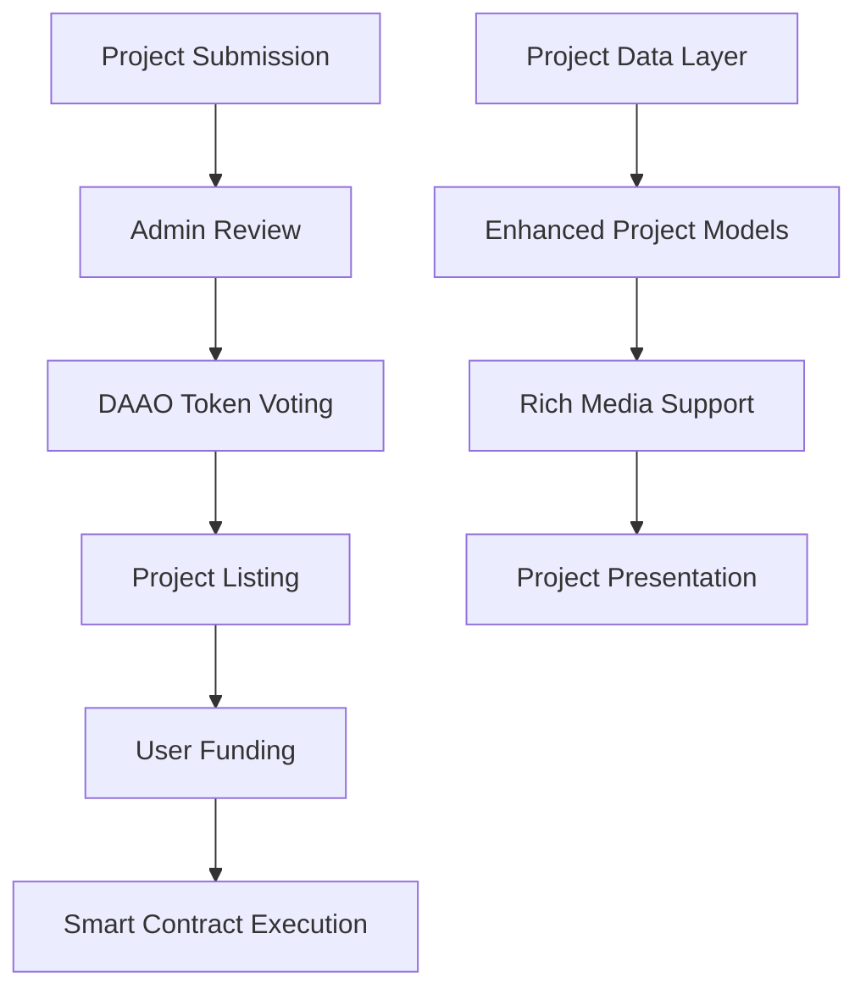

# Design Document

## Overview

This design outlines the transformation of the existing AI agents platform into a comprehensive project funding platform. The transformation involves systematic renaming of all agent-related terminology to project-related terminology, restructuring data models to support rich project information, implementing a DAAO token-based voting system, and enhancing project presentation with multimedia content.

The platform will enable entrepreneurs to submit detailed project proposals, community members to vote on project listings using DAAO tokens, and users to fund approved projects through smart contracts.

## Architecture

### High-Level Architecture



### Core Components

1. **Enhanced Data Models**
   - Rich project information structure
   - Multimedia content support
   - Team and funding details

2. **User Interface Components**
   - Project browsing and discovery
   - Detailed project presentation pages
   - Enhanced project cards with rich media
   - Project funding interface (using existing smart contracts)

3. **Terminology Transformation**
   - Systematic renaming of all agent-related code to project-related
   - URL and route updates
   - Component and file renaming

## Components and Interfaces

### Data Model Transformation

#### Current Agent Model → New Project Model

**File Transformations:**
- `src/types/agent.ts` → `src/types/project.ts`
- `src/abi/agent.ts` → `src/abi/project.ts`
- `src/constants/agents/` → `src/constants/projects/`
- `src/components/agents/` → `src/components/projects/`
- `src/helper/agent/` → `src/helper/project/`
- `src/utils/agent.ts` → `src/utils/project.ts`

#### Enhanced Project Data Structure

```typescript
export type ProjectStatus = 'deployed' | 'upcoming';

export type ProjectStaticBaseInfo = {
  slug: string;
  symbol: string;
  name: string;
  description: string;
  detailedOverview: string;
  problemStatement: string;
  solution: string;
  targetMarket: string;
  imageDesktop: string;
  imageMobile: string;
  logo?: string;
  chainId: number;
  id: string;
  tags: string[];
  category: string;
  link: string;
  socials: { [platform: string]: string }[];
  
  // Enhanced project information
  pitchDeckUrl?: string;
  demoVideoUrl?: string;
  websiteUrl?: string;
  whitePaperUrl?: string;
  
  // Team information
  team: {
    name: string;
    role: string;
    bio: string;
    avatar: string;
    linkedIn?: string;
    twitter?: string;
  }[];
  
  // Funding information
  fundingGoal: string;
  useOfFunds: {
    category: string;
    percentage: number;
    description: string;
  }[];
  
  // Project timeline
  milestones: {
    title: string;
    description: string;
    targetDate: Date;
    completed: boolean;
  }[];
  
  holders: {
    address: string;
    share: string;
  }[];
};

export type UpcomingProjectStaticInfo = ProjectStaticBaseInfo & {
  status: 'upcoming';
  launchDate: Date;
};

export type DeployedProjectStaticInfo = ProjectStaticBaseInfo & {
  address: Hex;
  status: 'deployed';
  marketData: {
    marketCap: string;
    tvl: string;
    volume: string;
    price: string;
    holdersCount: number;
    fundingProgress: number; // percentage
    totalFunded: string;
  };
  bornDate: Date;
  expiryDate: Date;
  swapInfo: {
    dex: SupportedDex;
    fee: number;
  };
};
```

### Component Transformations

#### Directory Structure Changes
```
src/components/
├── projects/ (renamed from agents/)
│   ├── ProjectCard.tsx (renamed from AgentCard.tsx)
│   ├── ProjectDetails.tsx (renamed from AgentDetails.tsx)
│   ├── ProjectList.tsx (renamed from AgentList.tsx)
│   └── ProjectVoting.tsx (new component)
├── projectActions/ (renamed from agentActions/)
│   ├── FundProject.tsx (renamed from ContributeAgent.tsx)
│   ├── VoteProject.tsx (new component)
│   └── ProjectProgress.tsx (new component)
└── ProjectPlaceholder.tsx (renamed from AgentPlaceholder.tsx)
```

#### Enhanced Components

1. **EnhancedProjectCard.tsx**
   - Rich media preview with demo video thumbnails
   - Funding progress indicator
   - Team member avatars
   - Category and tag display
   - Pitch deck and demo links

2. **ProjectDetails.tsx**
   - Comprehensive project overview with problem/solution sections
   - Team member profiles with bios and social links
   - Interactive funding breakdown charts
   - Milestone timeline visualization
   - Media gallery (images, videos, pitch deck)

3. **ProjectMediaSection.tsx**
   - Demo video player
   - Pitch deck viewer/download
   - Project image gallery
   - Social media links integration

### Route Transformations

```typescript
// Current routes → New routes
/agent/[slug] → /project/[slug]
/agents → /projects
/liveAgents → /liveProjects
/agent/[slug]/contribute → /project/[slug]/fund
```

## Data Models

### Enhanced Project Data Examples

#### Technology Innovation Project
```typescript
{
  slug: "ai-healthcare-diagnostics",
  name: "AI Healthcare Diagnostics Platform",
  symbol: "AIHD",
  description: "Revolutionary AI-powered diagnostic platform that reduces medical diagnosis time by 80% while improving accuracy to 99.2%",
  detailedOverview: "Our platform leverages advanced machine learning algorithms trained on over 10 million medical cases to provide instant, accurate diagnoses. The system integrates seamlessly with existing hospital infrastructure and provides real-time decision support to healthcare professionals.",
  problemStatement: "Current medical diagnosis processes are slow, expensive, and prone to human error, leading to delayed treatments and increased healthcare costs.",
  solution: "AI-powered diagnostic engine that analyzes medical data in real-time, providing instant recommendations with 99.2% accuracy.",
  targetMarket: "Healthcare institutions, diagnostic centers, and telemedicine platforms globally - $240B market opportunity",
  category: "Healthcare Technology",
  fundingGoal: "2500000", // $2.5M
  pitchDeckUrl: "https://example.com/pitch-deck.pdf",
  demoVideoUrl: "https://youtube.com/watch?v=demo123",
  team: [
    {
      name: "Dr. Sarah Chen",
      role: "CEO & Co-founder",
      bio: "Former Head of AI at Mayo Clinic, 15+ years in medical AI research",
      avatar: "/team/sarah-chen.jpg",
      linkedIn: "https://linkedin.com/in/sarahchen"
    },
    {
      name: "Michael Rodriguez",
      role: "CTO & Co-founder", 
      bio: "Ex-Google AI engineer, PhD in Machine Learning from Stanford",
      avatar: "/team/michael-rodriguez.jpg"
    }
  ],
  useOfFunds: [
    { category: "R&D", percentage: 40, description: "AI model development and training" },
    { category: "Regulatory", percentage: 25, description: "FDA approval and compliance" },
    { category: "Marketing", percentage: 20, description: "Go-to-market strategy" },
    { category: "Operations", percentage: 15, description: "Team expansion and infrastructure" }
  ],
  milestones: [
    {
      title: "MVP Launch",
      description: "Beta version with 5 partner hospitals",
      targetDate: new Date("2025-06-01"),
      completed: false
    },
    {
      title: "FDA Approval",
      description: "Regulatory approval for US market",
      targetDate: new Date("2025-12-01"),
      completed: false
    }
  ]
}
```

#### Sustainable Energy Project
```typescript
{
  slug: "solar-blockchain-grid",
  name: "Decentralized Solar Energy Grid",
  symbol: "DSEG",
  description: "Blockchain-powered peer-to-peer solar energy trading platform that enables homeowners to sell excess solar energy directly to neighbors",
  detailedOverview: "Our platform creates a decentralized energy marketplace where solar panel owners can automatically sell excess energy to nearby consumers through smart contracts. The system reduces energy costs by 30% while promoting renewable energy adoption.",
  problemStatement: "Traditional energy grids are inefficient, centralized, and don't incentivize renewable energy production at the household level.",
  solution: "Blockchain-based energy trading platform with IoT integration for automated energy transactions and grid optimization.",
  targetMarket: "Residential solar owners and energy consumers in deregulated markets - $50B opportunity",
  category: "Clean Energy",
  fundingGoal: "1800000", // $1.8M
  pitchDeckUrl: "https://example.com/solar-pitch.pdf",
  demoVideoUrl: "https://youtube.com/watch?v=solar-demo",
  team: [
    {
      name: "Alex Thompson",
      role: "Founder & CEO",
      bio: "Former Tesla Energy executive, 12 years in renewable energy sector",
      avatar: "/team/alex-thompson.jpg"
    },
    {
      name: "Dr. Priya Patel",
      role: "Chief Technology Officer",
      bio: "Blockchain researcher, PhD in Electrical Engineering from MIT",
      avatar: "/team/priya-patel.jpg"
    }
  ]
}
```

## Error Handling

### Media Handling Error Handling
- Invalid media URL validation
- Broken link detection for pitch decks and videos
- Image loading fallbacks
- Social media link validation

### Funding Error Handling
- Insufficient balance checks
- Funding deadline validation
- Smart contract execution failures
- Transaction confirmation handling

## Testing Strategy

### Unit Testing
- Project data model validation
- Component rendering with new project data
- Utility function transformations
- Smart contract interaction mocks

### Integration Testing
- Enhanced project data rendering
- Media content loading and display
- Funding process with existing smart contracts
- Project filtering and search functionality

### E2E Testing
- Project browsing and detailed view navigation
- Media content interaction (videos, pitch decks)
- Responsive design across devices
- Project funding flow with enhanced UI

### Migration Testing
- Data transformation accuracy
- URL redirect functionality
- Backward compatibility checks
- Performance impact assessment